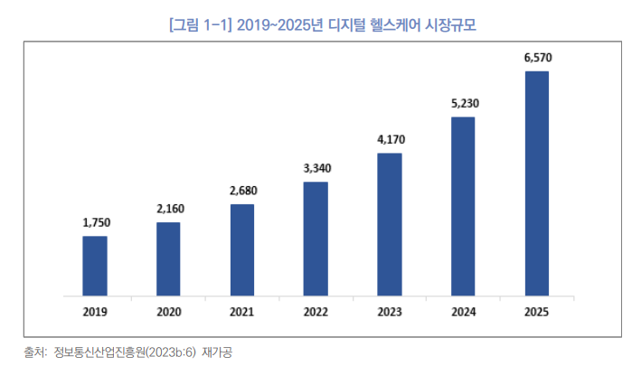
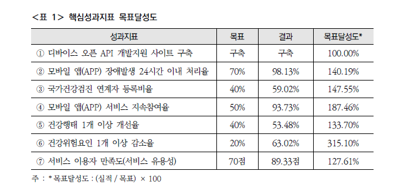

# 🩺모바일 헬스케어 서비스 고객 이탈 예측 시스템
## 팀 명 : Team Healtics💊
## 👥 팀원소개
| 팀장 | 팀원 | 팀원 | 팀원 |
|------|------|------|------|
|    최성장  |    김승호  |    박수빈  |    최호연  | 

 

#### 🗓️ 개발 기간
> 2025.05.15 ~ 2025.05.16 (총 2일)

## 📌 1. 프로젝트 개요

### 💁 1.1 프로젝트 소개
- 2020년 과학기술정보통신부는 의료 서비스의 퀄리티 향상과 의료비 절감을 위해서 IT 기술이 융합된 건강 및 질병 관리 산업 기술을 ‘디지털 헬스케어’로 정의. 
- IT 디지털 기술을 활용해서 개개인마다 맞춤형으로 디테일한 건강 관리 및 질병 예방이 가능해지는 서비스.
- 지금은 스마트폰의 시대! 디지털 헬스케어에서도 모바일은 빠질 수 없는 분야.
  ➡️ 모바일 헬스케어란 애플리케이션이나 웨어러블 기기를 통해서 일상에서 관리하는 종류를 뜻함. 
### 📚 1.2 주제 선정 배경
- 의료 서비스의 패러다임이 ‘치료･공급자’ 중심에서 ‘예방･소비자’ 중심으로 변화하면서 디지털
헬스케어에 대한 수요가 꾸준히 증가하고 있음.

- 디지털 헬스케어 기술 관련 특허 등록 건수는 2012년부터 2020년까지 지속적으로 증가하였으며, 2020년 이후에는 특허 등록이 급증하여, 2020년도(2,273건) 대비 2022년도(3,839건)의 성장률은 68.9%를 기록함.(특허청, 2023)

- 모바일 헬스케어 서비스 앱은 설치 장벽이 낮고 초기 진입률은 높지만, 지속적인 사용률은 매우 낮은 경향을 보입니다.
  예: 걷기 앱, 식단 기록 앱, 명상 앱 등은 설치 후 며칠 내로 이탈하는 비율이 높음.
   ➡️ 이탈률 분석은 장기 사용자 확보의 첫걸음입니다.

- 모바일 헬스케어 서비스 앱의 근본적인 목적은 지속적 건강 관리와 행동 변화 유도. 이탈자에 대한 분석과 예측이 이루어지지 않으면 실질적인 건강 개선 효과를 달성하기 어려움.이탈자의 특성과 패턴 분석을 통해 개선될 수 있고, 어떤 사용자들이 왜 이탈하는지 예측 가능.

- 이러한 경향에 따라 공공부문에서도 디지털 헬스케어 관련 대책 및 서비스를 구축하기 위해 노력하고 있음.

### 🎯 1.3 프로젝트 목표
##### 1️⃣ 사용자 행동 데이터를 기반으로 이탈자 특성 분석
- Fitbit 등 웨어러블 디바이스 데이터를 활용하여,
- 이탈자와 비이탈자의 활동 패턴 차이를 정량적으로 분석
- 주요 분석 지표 예: 일일 걸음 수, 활동 시간, 칼로리 소모량, 앱 사용 빈도 등
##### 2️⃣ 머신러닝을 활용한 이탈 예측 모델 개발
- 이탈 여부를 예측하는 분류 모델(Logistic Regression, Random Forest, XGBoost 등) 구축
- 모델 성능 평가를 통해 가장 정확한 예측 방법 선정
 (예: Accuracy, Precision, Recall, F1-score 등)
##### 3️⃣ 이탈 위험 사용자 조기 탐지 시스템 설계
- 예측된 고위험군을 기반으로 조기 개입 전략 설계 (예: 푸시 알림, 맞춤 운동 제안, 목표 재설정 등)
##### 4️⃣ 서비스 개선을 위한 인사이트 도출
- 이탈 원인 및 패턴을 기반으로,  UX 개선, 리텐션 강화 기능 도입, 사용자 유형별 맞춤 서비스 제공에 활용 가능.

## ⚙ 2. 데이터 분석 및 전처리
### 💾 2.1 데이터 셋
참고 데이터셋: **FitBit Fitness Tracker Data**  
출처: https://www.kaggle.com/datasets/arashnic/fitbit/data

### 🛠 2.2 기술 스택
| 분류 | 기술 |
|------|------
| 언어 |   |
| 머신러닝 | |
| 데이터 분석 |   |
| 데이터 시각화 |  |
| 화면구현 | |

### 🔍️ 2.3 분석 프로세스
#### 🧩 변수 선정 과정
✔ **도메인 지식 기반 선택**
- 건강 상태, 활동 정도와 직접 연관된 Fitbit 데이터 중	‘활동량’과 ‘신체 움직임’ 관련 지표 위주로 변수 선정.

✔ **단순하지만 중요한 변수 위주**
- 너무 복잡하거나 상호 의존적인 변수를 배제하고, 기본 활동량과 운동 시간을 포함하여 이탈 예측에 효과적일 것 같은 변수 중심. 

✔ **데이터 가용성과 품질 검토**
- 결측치가 적고 신뢰도가 높은 변수 중심으로 선택.

✔ **라벨링 기준과 연계**
- CHURN 라벨이 이 변수들의 일정 기준 미달 여부로 생성되므로 변수들과 라벨 간 직관적 관계 확보 가능

💡**변수선정 목적**
-	이탈(Churn) 가능성이 높은 사용자 구분.
-	단순한 수치 기반으로 건강·활동 저하 여부 판별.
-	후속 모델링 및 튜닝에 활용 가능한 기본 데이터셋 구축.

#### 🧾 수집한 데이터에 대한 설명
- 수집 방법 : 사용자의 활동 데이터를 기반으로 수집 되었음.

#### ✅ 1차 선정 변수

#### 🔗 변수 상관관계
(daily_fitbit_sema_df_unprocessed.csv)  데이터에 실제로 존재하는 컬럼 중
 1. 수치형 데이터
 2. 결측치가 40% 이하인 컬럼
 3. 상위 15개를 자동으로 추출 
 4. 상위 15개의 상관관계를 히트맵으로 확인.
 5. 그 중 관계성이 높은 5가지를 선정하여 이탈자 판단 기준으로 사용.

 

    
    

#### 📌  변수 선정

 

### 📊 2.4 데이터 전처리 결과서
#### 🧹 **데이터 전처리 방식**

#### 🔍 **탐색적 데이터 분석**

- 탐색적 데이터 분석을 진행한 결과, 본 프로젝트의 대상이 된 모바일 헬스케어 서비스의 사용자는 여성의 이탈률이 약 18.5%, 남성이 약 3% 정도로 매우 낮음. 즉, 여성 이용자가 남성 이용자에 비해 이탈 가능성이 더 높게 예측.
   
- 학습 데이터에 대한 탐색적 데이터 분석(Exploratory Data Analysis, EDA) 수행 결과 결측치가 포함된 행이 존재하며, 주요 피처(base_cols) 또는 id에 결측치가 있으면 제거함.
  
- 사용자별로 그룹화 후 평균값을 산출하여 이상값 영향을 완화시킴.
  
- 피처별 통계량(평균, 최소/최대값) 등을 통해 사용자 활동 패턴 파악 가능.
  
 ✂️ **결측치 처리 방법 및 이유**
- **처리방법** :dropna() 사용하여 주요 피처 및 id 컬럼에 결측치가 존재하는 행을 제거함.
- **이유** : 이상치 또는 누락된 정보가 많으면 모델 성능 저하 가능성이 크며, 평균 계산에 영향을 줄 수 있기 때문에 제거함.
  
 ✔ **전체 결측치 현황**
- 원본 데이터 전체 기준으로 분석한 결과, 총 236,584개의 셀에 결측치가 존재했으며, 이로 인해 7,410개의 행(사용자 기록)에 하나 이상의 결측값이 포함되어 있는 것으로 확인.
- 이는 전체 데이터의 품질 저하와 분석 신뢰도에 영향을 줄 수 있는 수준의 누락 정보로 판단.
 
✔ **이탈률 판단에 필요한 핵심 피처 기준 결측 현황**
- 이탈률을 산정하기 위해 사용한 주요 활동량 변수 5개(steps, calories, very_active_minutes, moderately_active_minutes, distance)를 기준으로 보면, 이 중 최소 1개라도 결측치가 포함된 데이터는 2,633개의 사용자 기록에 해당하며, 이 과정에서 6,670개의 셀 값이 누락된 것으로 확인.
- 따라서 이 데이터들은 이탈자 판단에서 제외하였습니다.

✔ **전처리 후 이탈률 분석 대상 수**
- 결측치 제거 및 사용자 단위 평균 정제를 거친 후, 최종적으로 71명의 사용자 데이터만이 이탈율 분석에 활용 가능. 이는 완전한 정보를 갖춘 사용자만을 대상으로 분석함으로써 데이터 품질을 보장하기 위한 전처리 결과.

✅ **결측치 처리 결과**

 [전체 기준] 결측치 포함 셀 수: 236584
 
[전체 기준] 결측치 포함 행 수: 7410
 
[이탈율 판단 기준 피처] 결측치 포함 셀 수: 6670
 [이탈율 판단 기준 피처] 결측치 포함 행 수: 2633

 [이탈율 계산 대상] 전처리 후 남은 사용자 수: 71 
 

✔ **이상치 판정 기준과 처리 방법 및 이유**
- 명시적인 이상치 제거는 수행하지 않았지만, CHURNED 라벨 생성 시 임계값 기준으로 간접적으로 이상적이지 않은 활동 데이터를 평가함.
- 예시 : steps < 6400, calories < 1800 등은 기준 이하로 판단하여 점수를 부여함. 이 기준은 이탈 판단의 기준이자, 활동 저하 패턴을 반영함.
  

    
    

- 본 분석에서는 이상치를 명시적으로 제거하지 않았으나, 활동량이 현저히 낮은 사용자를 이탈자로 분류하는 방식으로 비정상적 행동을 간접적으로 걸러내는 기준을 적용.
- 결과적으로 6명은 활동 패턴이 정상적이지 않다고 판단되어 제거(이탈자 처리)되었으며, 65명의 사용자만이 정제된 최종 분석 대상으로 남음.

[이탈자 판단] 조건에 따라 이탈자(CHURNED=1)로 분류된 사용자 수: 6
 [정제된 데이터] 이탈자로 간주되지 않은 사용자 수: 65
 
 

✔ **적용한 Feature Engineering 방식**
- **집계 기반 Feature 생성**: 동일한 사용자 ID별로 데이터를 평균 처리하여 사용자 단위 대표값으로 변환함.
- **라벨링 엔지니어링**: 건강 활동 수준이 낮은 사용자에게 점수를 부여하고, 총 점수가 4점 이상인 경우 CHURNED=1로 설정하여 분류 문제로 전환함.
- 추가적으로 입력 변수 X, 목표 변수 y로 분리함.

### 📋 2.5 모델 성능 비교 및 해석
⚖️ **비교한 모델**
- Logistic Regression
- Random Forest
- XGBoost
- SVM

🔍 **모델 분석 결과**
- 본 프로젝트에서는 4가지 분류 알고리즘(Logistic Regression, Random Forest, XGBoost, SVM)을 적용하여 모델 성능을 비교
- 성능 평가는 Accuracy, Precision, Recall, F1-score 네 가지 지표를 기준으로 진행
- Random Forest와 XGBoost는 전반적인 성능에서 가장 우수
- SVM은 정확도는 높지만 분류 성능은 부적절
- Recall(민감도)은 모든 모델에서 개선 여지 있음    
    
🌟 **최종 선택 모델 후보:  Random Forest 또는 XGBoost**

#### 📊 튜닝 후 Random Forest vs XGBoost 성능비교

**1. 성능 면에서는 Random Forest가 근소하게 우위**
- Random Forest는 **정확도(0.9967)**와 **F1 Score(0.9333)**에서 더 높은 수치를 보임
- 특히 Precision이 1.0으로 완벽한 예측을 보인 반면, XGBoost는 약간 낮은 0.9
- 하지만 정확도가 지나치게 높고 Precision이 완벽한 점은 과적합 가능성을 의심 

**2. XGBoost는 더 높은 일반화 성능과 실용성 제공**
- XGBoost는 정규화(L1/L2), 조기 종료, 불균형 클래스 처리 등 다양한 기능으로 실제 데이터에서의 일반화 성능이 더 안정적

**3. 피처 중요도 해석과 운영 전략 도출에 유리**
- 두 모델 모두 피처 중요도 시각화가 가능하지만, XGBoost는 SHAP 등의 라이브러리와 연동해 더욱 정교한 해석이 가능
- 또한 이탈을 유발하는 주요 행동 패턴을 뽑아내어 마케팅 및 사용자 리텐션 전략 수립에 활용하기 적합

🏆 **최종 선정 모델 : XG Boost**

#### 📊 최종 모델 튜닝 전 후 비교 데이터

✅**최종 모델 선정 이유**
- Random Forest는 뛰어난 예측 성능을 보였지만, XGBoost는 비슷한 수준의 성능을 유지하면서도, 불균형 데이터 대응력, 일반화 가능성, 모델 해석력, 튜닝 유연성 측면에서 더 우수한 장점을 가지고 있었음.
- 특히, 실제 사용자 이탈 예측과 같은 민감한 의사결정에는 단순한 Accuracy보다도 재현율(Recall)과 모델의 해석 가능성이 중요하므로, 이를 종합적으로 고려해 XGBoost를 **최종예측모델**로 선정

## 🖥 3. 시연페이지 
  
  
  
  
  
  
  
  
  
  

## 📌 4. 결론
### ❗ 4.1 한계점
- **실 데이터 양이 부족** : 수집한 데이터의 절대적인 이용자 수의 부족으로 학습에 어려움이 있는 것으로 판단.
- **이탈률 분석 조건의 세분화가 어려움** : 데이터 양의 부족으로인한 라벨 정의 단순화로 과하게 쉬운 모델로 평가 됨.
- **모델의 정확한 성능 파악이 어려움** : 데이터 양이 커질 경우 오류가 발생할 가능성이 있음.
  
### ✨ 4.2 기대효과
- **건강 증진** : 공공기관인 보건소에서 진행함에 따라, 헬스케어 앱 이용자들을 기간 종료 이후로도 지속관리하며,
  더 나아가 국민의 건강 증진까지 기대
- **비용절감** : 현재 국민 의료비 증가에 비해 경제 성장률이 감소하는 추세. 앱을 통해 건강 관리가 가능해짐으로써
  국가 및 가정이 부담해야 할 의료비가 감소하게 됨.
- **헬스케어 시장 성장** : 공공기관에서 성공적으로 사업을 이루어냈다는 사례를 통해(지표 그래프로 만들어서 첨부)
  시장의 성공 가능성을 높이고 활력을 불러일으킬 수 있음.

    
    

## 📝 5. 한 줄 회고
